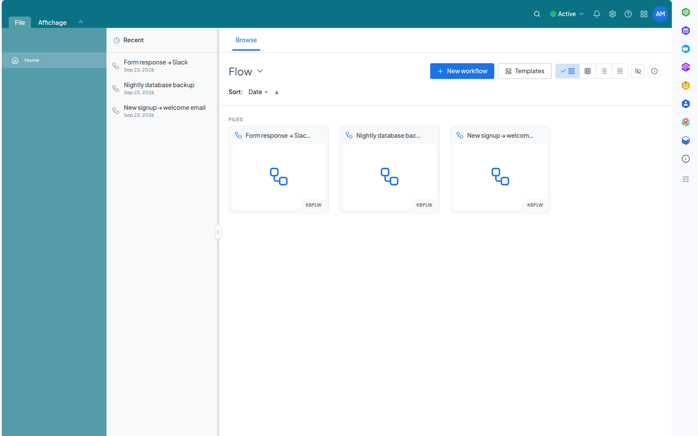

<!--
  SPDX-FileCopyrightText: 2026 Kubuno contributors
  SPDX-License-Identifier: AGPL-3.0-or-later
-->

<div align="center">


# Kubuno — Flow

[](LICENSE)


**A visual workflow orchestrator for [Kubuno](https://github.com/kubuno/core) — the self-hosted, libre (AGPLv3) cloud platform, a sovereign alternative to Google Workspace and Microsoft 365.**

Automate your work by wiring nodes together on a canvas — triggers, logic, native Kubuno actions, databases, sandboxed code and third-party integrations — no code required, all on your own server.

</div>

---

## Screenshots



<sub>Visual workflow automation</sub>

## Features

- **Triggers** — start a workflow manually, on a schedule (cron), from an inbound public webhook, from an incoming email, from an incoming chat message (ideal in front of an AI node), from a Kubuno event on the core's bus (a form submitted, a message sent, a contact updated, a file uploaded, a calendar event created), from another workflow (sub-workflows), when another of your workflows fails (error workflows), or over MCP and SSE.
- **Native Kubuno connectors** — act directly on your own instance without leaving it: create a calendar event, send a chat message, send mail, create a contact, create a task, list Drive files, read form responses, or push a notification — all through the core's inter-module service relay, so a workflow only reaches modules that are actually installed.
- **Logic & data nodes** — filter, branch (switch/cases), compare, calculate, aggregate (sum/avg/count), sort, transform and reshape data, plus wait/delay steps, so a workflow can make decisions and massage its payload between steps.
- **Sandboxed code node** — run JavaScript inside a QuickJS engine with enforced time and memory limits, so a runaway script is interrupted instead of monopolizing the module's process.
- **Database nodes** — read from and write to external data stores (MongoDB, MySQL, Redis, and Supabase).
- **AI node** — call a configurable AI provider from within a workflow.
- **Third-party integrations** — a large catalog of connectors for outside services (messaging, CRMs, project trackers, storage, developer tools and more), each with its own authentication.
- **Safe outbound networking** — an SSRF guard always blocks non-HTTP(S) schemes, loopback, private (RFC 1918), link-local, CGNAT, ULA and instance-metadata addresses; admins can further restrict egress with allow/deny host lists, and cap the size of inbound webhook bodies. A database node runs its SQL exactly as written — values from the trigger, such as a public webhook's body, go through the query's parameters and can never reshape the statement.
- **Reliable execution** — configurable per-node timeouts, retries with exponential backoff, and a bounded per-workflow execution history — all tunable instance-wide from the core's admin console.
- **Your choice of database** — runs on PostgreSQL, MySQL/MariaDB or SQLite: a single build connects to whichever engine the instance is configured with, and SQLite makes a self-contained, server-less install possible.
- **Workflows live in Drive** — each workflow is stored as a file in your Drive, so deleting a workflow removes its file and execution history together, and the trash is auditable (`?trashed=true`).

## Architecture

Kubuno is **modular**: a **core** (the platform's "operating system") plus independent **modules**. Each module — Flow included — is a **separate process** that connects to the core at startup on its own dedicated port (**3118** for Flow); the core proxies its routes (`/api/v1/flow/*`), distributes events and serves its runtime-loaded React frontend bundle.

- **Backend** — `src/`: Axum + SQLx through the shared `kubuno-db` layer (PostgreSQL, MySQL/MariaDB or SQLite, chosen at run time; namespace `flow`); a node runtime engine in `src/nodes/` and `src/runtime/`; migrations in `migrations/`.
- **Frontend** — `frontend/`: a React bundle built to `entry.js`, consuming `@kubuno/sdk`, `@ui` and `@kubuno/drive` from the host at runtime via its import map.

## Install

The easiest way to self-host a full Kubuno instance (core + every module, Flow included) is the **all-in-one Docker image** (`ghcr.io/kubuno/kubuno`). See **[kubuno/docker](https://github.com/kubuno/docker)** for `docker compose` instructions.

To add this module to an existing instance, install its **Kubuno package** (`.kbpkg`) — the single format the core installs by itself, the same file on Linux, Windows and macOS. Grab it from the admin console's marketplace, or install it offline from the command line:

```bash
sudo kubuno modules:install dist/flow-<version>-<os>-<arch>.kbpkg
sudo systemctl restart kubuno         # the core loads the module on (re)start
```

The `.kbpkg` is a ZIP archive rooted at the module folder; the core unpacks it in pure Rust, so installation is identical on every platform. It is the **only** distribution format for a module — a module is not a system service, so there are no `.deb`/`.rpm`/`.exe`/`.pkg` packages.

## Build & development

**Requirements:** Rust ≥ 1.82, Node.js ≥ 24, and a database — PostgreSQL 16, MySQL/MariaDB or SQLite.

```bash
cargo build --release                     # → target/release/kubuno-flow (shared crates from git tags)
cd frontend && npm ci && npm run build    # → dist/{entry.js, entry.css} (@kubuno/* from npm)
bash build_kbpkg.sh                       # → dist/flow-<version>-<os>-<arch>.kbpkg
bash build_kbpkg.sh --install             # build, install into the local module store, and restart
```

> Shared dependencies come from Kubuno — no `kubuno/core` checkout required:
> - **Rust** — shared crates via tagged git dependencies on `kubuno/core`.
> - **Frontend** — `@kubuno/sdk`, `@kubuno/ui` and `@kubuno/drive` from the `@kubuno` npm scope, resolved at runtime to the host's singletons through its import map.

## Tech stack

Rust 2021 · Axum 0.7 · Tokio · SQLx 0.9 via `kubuno-db` (PostgreSQL 16 · MySQL/MariaDB · SQLite) · QuickJS (sandboxed code node) — React 19 · TypeScript · Vite · Tailwind CSS v4 · Zustand · React Query.

## Contributing

Contributions are welcome. Please open an issue to discuss any significant change before submitting a pull request.

## License

[AGPL-3.0-or-later](LICENSE) © Kubuno contributors.
